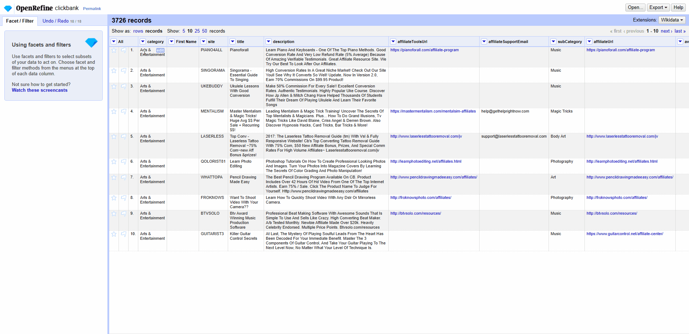

# OpenRefine Code Editor Dialogue

This is a tampermonkey script that will help you write python code more comfortably and efficiently.

It Changes the default editor dialogue into a complete python code editor.

Example:



# Usage

Create a new Tampermonkey script with the following snippets. Remember to change the file path.

Tampermonkey Script:

```javascript
// ==UserScript==
// @name         OpenRefine Code Editor
// @namespace    http://tampermonkey.net/
// @version      0.1
// @description  try to take over the world!
// @author       You
// @match        http://127.0.0.1:3333/*
// @require      https://cdn.jsdelivr.net/npm/lodash@4.17.21/lodash.min.js
// @require      file://C:\<Path to your openrefine-textarea2editor.js>
// @grant        none
// ==/UserScript==
//
```

**Note:** This requires file permission to be enabled for Tampermonkey in the extension menu.

## Or

You can just copy and paste the content of the [openrefine-textarea2editor.js](openrefine-textarea2editor.js) script.
